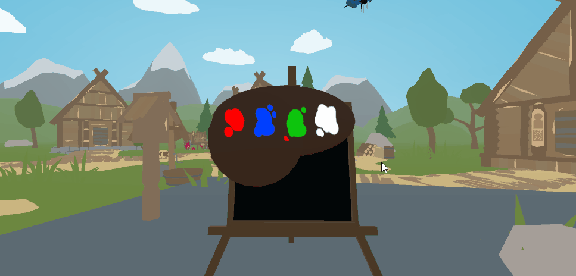
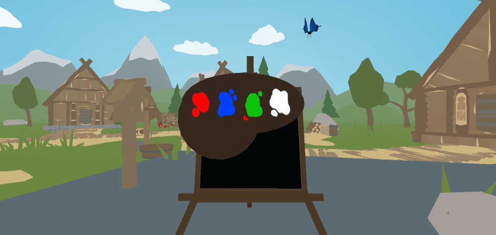
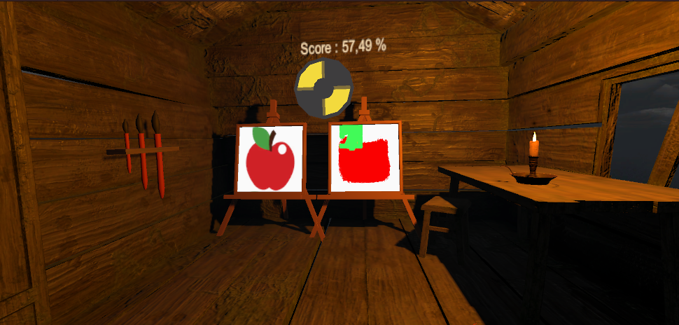
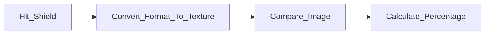
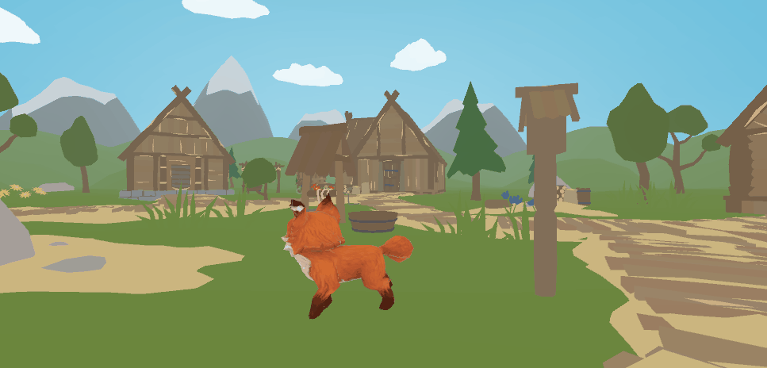

# Projet de peinture en VR - Unity

A rendre pour le 20/03/2023

Le projet VR de peinture est une expérience immersive de peinture en réalité virtuelle. Les joueurs peuvent se téléporter dans un atelier virtuel et utiliser différents outils pour peindre des œuvres d'art numériques.

 Les fonctionnalités comprennent :

## 3 interactions de peinture différentes 

| Démonstration | Explication |
|---------|---------|
|  | **Pinceau** : Pour peindre|
|  | **Spray** : Pour pulveriser la peinture|
|  | **Baguette magique** : |

## Une palette de couleurs 

| Démonstration | Explication |
|---------|---------|
|  | **Mobile** : attachée à la main gauche|
|  | **Couleurs** : Choix des couleurs|

## La possibilité de choisir l'outil souhaité en l'attrapant

## 1 mini-jeu pour reproduire le dessin d'un tableau et obtenir un score de ressemblance

| Démonstration | Explication |
|---------|---------|
|  | **Téléportation** : Sélectionner le rocher magique pour vous téléporter dans l'atelier, ou l'armoire magique pour retourner dans le monde originel|
|  | **Taille du pinceau** : Peinture, possibilité de changer la taille (avec les pinceau accroché au mur à gauche) et la couleur du pinceau (palette)|
|  | **Score** : Dessiner une pomme puis sélectionner le bouclier magique pour obtenir votre score de ressemblance en pourcentage. |

Fonctionnement général

Calcul du score :

Le programme va compare les 2 textures en calculant la différence de chaque canal de couleur (R, V, B et Alpha) pour chaque pixel, puis en calculant la moyenne de toutes les différences. 

## Autre
| Démonstration | Explication |
|---------|---------|
|  | **Renard** : parce que c'est trop mignon !! Regardez le faire ces petites roulades|

## Groupe

* [Sebila Doubaeva](https://github.com/taredalen)
* [Camille Bayon de Noyer](https://github.com/Kamomille)
* [Maelle Marcelin](https://github.com/maaelle)
* [Monia Moghraoui](https://github.com/SoniaMogh)

## Asset Store

* [Renard](https://assetstore.unity.com/packages/3d/characters/animals/toon-fox-183005)
* [Papillon](https://assetstore.unity.com/packages/3d/characters/animals/insects/butterfly-animated-58355)
* [Atelier du mini jeu](https://assetstore.unity.com/packages/3d/environments/cabin-environment-98014)
* [Village principal](https://assetstore.unity.com/packages/3d/environments/landscapes/rpg-poly-pack-lite-148410)
* [Table pour poser les outils](https://assetstore.unity.com/packages/3d/props/wooden-pbr-table-112005)

